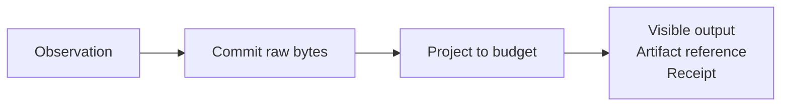

<p align="center">
  
</p>

<h1 align="center">Distill</h1>

<p align="center">
  <b>Bounded, recoverable context projection for coding agents.</b>
</p>

Distill is a local native engine that captures tool observations, commits the
raw bytes, and returns a deterministic model-visible projection within an
explicit budget. Every reduced result carries a durable artifact reference and
a receipt describing what was retained or omitted.

The native v0.1.0 package is qualified on Linux x86_64 GNU and macOS arm64 from
one source tree and published as `@arthjean/distill@0.1.0`. Its npm tarball
embeds the exact receipt-bound executables. The retired TypeScript MCP-first
implementation remains recoverable through the recorded pre-US-020 ref, while
its historical evidence stays in the repository.

## Product contract



The engine:

- persists source bytes before returning an omitting projection;
- restores unexpired artifacts after process restart and verifies SHA-256;
- applies versioned byte or token budgets to the complete visible envelope;
- emits versioned JSON for machine consumers and diagnostics only on stderr;
- performs no runtime network requests;
- treats captured output as untrusted data, never as commands or configuration.

The central Rust module has no Codex, Claude, MCP, or JSON-RPC types. Host
adapters translate protocols and acquisition only.

## Build from source

Requirements: Rust 1.97.1 and the platform SQLite development libraries.

```bash
cargo build --locked --release
./target/release/distill --help
```

Evaluation and qualification tooling additionally requires Bun 1.3+. It does
not require a package installation.

Create an unpublished archive for the current supported packaging host:

```bash
./scripts/package-native.sh
```

This produces `dist/native/distill-<platform>.tar.gz` and its SHA-256 file. It
does not publish, tag, change a version, or qualify the resulting source tree.

The Linux archive targets GNU libc and uses the host's `libgcc_s` and
`libsqlite3.so.0`. The macOS archive uses the macOS system runtime and SQLite.
No static or musl compatibility is claimed.

## npm package

The native distribution is published as `@arthjean/distill`:

```bash
npm install --global @arthjean/distill
distill --help
```

The package embeds both qualified native executables. It performs no
installation-time download. npm rejects other operating systems, while the
launcher rejects unsupported architectures and Linux runtimes.

## CLI

Project stdin into a bounded result:

```bash
printf 'large tool output' |
  distill project --budget 2048 --unit bytes --json
```

Read a file through an allowlisted root:

```bash
distill \
  --root workspace=/absolute/path/to/project \
  read --root-id workspace --path src/main.rs --budget 4096 --json
```

Run a non-interactive process without a shell:

```bash
distill \
  --root workspace=/absolute/path/to/project \
  run --cwd-root workspace --cwd . --budget 4096 -- cargo test
```

Recover an omitted region under a budget:

```bash
distill artifact slice <artifact-id> --start-line 120 --lines 40 --budget 2048
distill artifact search <artifact-id> --pattern 'error[E0308]' --budget 2048
```

`--pattern` is literal text, never a regular expression.

State what you are reading for, so the budget buys the lines that answer it:

```bash
distill \
  --root workspace=/absolute/path/to/project \
  read --root-id workspace --path src/projection.rs --budget 4096 \
  --focus 'where is the payload budget spent'
```

`--focus` is optional, at most 256 UTF-8 bytes, and literal text on the same
terms as `--pattern`. It only orders which of the source's own lines survive: it
adds nothing, lifts no budget, and is never echoed back. The Claude tools accept
the same field, and the Codex hook derives one from the tool input it already
received.

Recover and inspect whole artifacts:

```bash
distill artifact get <artifact-id> --json
distill artifact trace <artifact-id> --json
distill status --json
distill gc --json
```

All commands are non-interactive. `run` accepts an executable and argv only: no
shell interpolation, PTY, remote execution, or general process supervision.

## Codex: automatic local-tool projection

Install the versioned `PostToolUse` hook:

```bash
distill setup codex \
  --config /absolute/path/to/codex-config.json \
  --command /absolute/path/to/distill \
  --mode active
```

Modes are `off`, `observe`, and `active`. Setup requires an explicit config
path, supports `--dry-run`, preserves the first-install bytes, is idempotent,
and supports `--restore`.

Automatic projection covers only supported local-tool events that Codex emits
through `PostToolUse`. Hosted tools and specialized paths that emit no supported
event are invisible to Distill, so Distill cannot diagnose them.

## Claude Code: explicit projected acquisition

Install the stdio MCP adapter:

```bash
distill setup claude \
  --config /absolute/path/to/claude-settings.json \
  --command /absolute/path/to/distill \
  --root workspace=/absolute/path/to/project
```

Claude receives four explicit tools:

- `distill_read`: bounded file acquisition under a configured root;
- `distill_run`: bounded argv-only process acquisition;
- `distill_artifact_slice`: bounded line range of an artifact already committed;
- `distill_artifact_search`: bounded literal search over that artifact.

The retrieval pair recovers a region an earlier projection omitted without
leaving Distill, under its own declared budget. Every tool also accepts an
optional `focus` stating what the call is looking for. Distill does not intercept
Claude's native `Read` or `Bash`. Selecting those tools bypasses projection. MCP
stdout contains JSON-RPC only.

## Supported and unsupported surfaces

| Surface                                           | V1 status          | Contract                                                       |
| ------------------------------------------------- | ------------------ | -------------------------------------------------------------- |
| Linux x86_64 GNU                                  | Qualified          | Embedded npm executable                                        |
| macOS arm64                                       | Qualified          | Embedded npm executable                                        |
| Codex supported local `PostToolUse` events        | Qualified          | Automatic off, observe, or active mode                          |
| Claude `distill_read` and `distill_run`           | Qualified          | Explicit MCP acquisition                                       |
| Claude `distill_artifact_slice` and `distill_artifact_search` | Qualified | Bounded MCP retrieval                                |
| Codex hosted tools without a supported hook event | Unsupported        | No interception and no Distill diagnostic                      |
| Claude native `Read` and `Bash`                   | Unsupported        | Bypass Distill                                                 |
| Windows, macOS x86_64, Linux arm64, Linux musl    | Unsupported        | No release claim                                               |
| Cursor, Windsurf, Continue, generic MCP clients   | Unqualified        | No v1 setup or compatibility claim                             |
| AST-aware code extraction                         | Deferred           | Use exact or bounded file projection                           |
| Programmable `code_execute` sandbox               | Removed from vNext | Use native agent tools or `distill run` for a fixed executable |

The complete host and platform matrix is in
[`docs/migration/mcp-first-to-native.md`](docs/migration/mcp-first-to-native.md).

## Architecture and evidence

- [Native architecture](docs/architecture/native-context-projection-engine.md)
- [Host integration contract](docs/integrations/native-surfaces.md)
- [Threat model](docs/security/context-projection-threat-model.md)
- [Migration from the MCP-first product](docs/migration/mcp-first-to-native.md)
- [Native distribution manifest](docs/distribution/native-assets.json)
- [Release qualification](evaluation/release/README.md)

The closed native distribution v2 aggregate binds the Linux and macOS receipts
to the pre-root-layout native tree
`77c75f741cd69a9b229dd73c1be435181db73cf1`. The Linux release gate covers 102
corpus fixtures, recovery, concurrency, latency, memory, fuzzing, and
zero-network behavior. The US-018 v5 paired gate scored 50/50 for raw and 50/50
for projected conditions with a 0 point delta. Those receipts remain historical
evidence and do not qualify the current source tree. The qualification gates
did not themselves publish an asset, tag, or version.

## Development

Native verification:

```bash
./scripts/check-native.sh
bun evaluation/corpus/check.mjs --verify
```

Build an unpublished native archive and verify its adjacent checksum:

```bash
./scripts/package-native.sh
```

The approved deletion and rollback record is
[`docs/migration/legacy-deletion-plan.md`](docs/migration/legacy-deletion-plan.md).

## License

[MIT](LICENSE)
