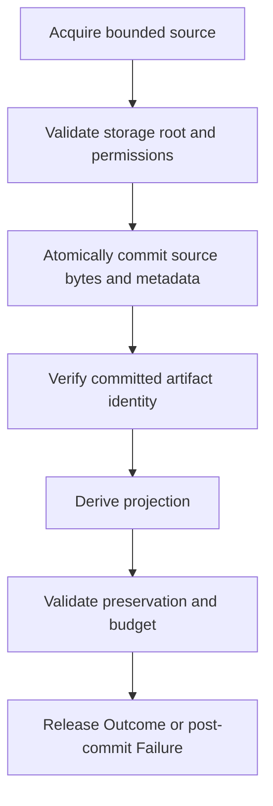

# ADR-001: Language-neutral context projection contract

- Status: Accepted
- Date: 2026-07-24
- Decision owners: Distill maintainers
- Scope: Product contract and central engine boundary

## Context

Distill currently exposes compression through tools owned by an agent host. That
surface cannot guarantee that an observation is reduced before the host adds it
to model context, and its optional recovery store ends with the server process.
The replacement must instead define one local operation whose result is bounded,
traceable, and recoverable for a declared lifetime.

Projection is intentionally not described as semantically lossless. Arbitrary
bytes do not have one context-independent meaning, and an extractive policy can
omit a fact that a later task needs. The product guarantee is narrower:

1. source bytes are durably captured before an omitting result is released;
2. model-visible output fits an explicit budget;
3. mandatory facts are never silently discarded to meet that budget;
4. every outcome explains its lineage and fidelity; and
5. committed source bytes are recoverable until the artifact expires.

## Decision

Distill is a local context projection engine. Its central module exposes one
operation:

```text
handle(Request) -> Outcome | Failure
```

The notation is conceptual. It does not prescribe an implementation language,
serialization library, transport, process model, or concurrency runtime.

The operation is deterministic for the same normalized request, source bytes,
policy version, projection version, and tokenizer version. Artifact identifiers,
capture timestamps, and implementation timing fields are the only permitted
nondeterministic receipt fields.

## Public contract

### Request

```text
Request {
  contract_version: Version
  request_id: OpaqueId
  source: Source
  budget: Budget
  preservation_profile: PreservationProfileId
  retention: Retention
}
```

`contract_version` selects the complete public semantics. The current contract
is `distill.context/v3`. `distill.context/v2` remains accepted and behaves
exactly as it did: v3 adds only the optional artifact selector described below,
so a v2 request that names no selector produces the same outcome and the same
receipt. A `distill.context/v2` request that does carry a selector fails with
`schema_unsupported`. A syntactically decodable `distill.context/v1` request
fails with `schema_unsupported`; there is no compatibility path that drops v1
fields. Unknown versions fail the same way.

`request_id` is supplied by the caller for correlation only. It does not become
an artifact identifier and does not provide durable idempotency. Repeating an ID
does not prevent process re-execution and does not replay a prior `Outcome`.

Request metadata is not part of v2. Persisting arbitrary request metadata or
adding durable idempotency is a separately versioned capability. Such a
capability requires explicit request fingerprint, retention, duplicate-conflict,
in-flight, crash-recovery, and PII semantics before it can enter this contract.

### Source

`Source` is a closed discriminated union with four variants:

```text
Source =
  | inline {
      bytes: ByteSequence
      media_type: MediaType?
    }
  | file {
      root_id: ConfiguredRootId
      relative_path: PathBytes
      binary_policy: BinaryPolicy
    }
  | process {
      executable: PathBytes
      argv: List<ArgumentBytes>
      cwd_root_id: ConfiguredRootId
      cwd_relative_path: PathBytes
      timeout_ms: Integer
      environment_profile: EnvironmentProfileId?
    }
  | artifact {
      artifact: ArtifactRef
      selector: ArtifactSelector?
    }
```

- `inline` captures the supplied byte sequence without requiring valid UTF-8.
  `media_type` is advisory source metadata in v2: it is not persisted and does
  not alter byte acquisition, projection policy, or the `text/plain` output
  media type. Giving it behavioral semantics requires a new contract version.
- `file` acquires one file beneath a configured local root. A root is resolved
  from local engine configuration, not accepted as an arbitrary request path.
- `process` launches one executable with an argv vector. It never implies a
  command shell, string interpolation, or configuration evaluation.
- `artifact` reuses a previously committed, unexpired source artifact. Its
  optional `selector` restricts the region that becomes visible.

Request policy validation precedes clock reads, file opens, process spawn,
artifact ID generation, and store mutation. A process accepts at most 4,096
arguments and at most 1,048,576 bytes across the executable plus every argument.
The exact byte limit is valid; an aggregate or count overflow fails with
`resource_exhausted`. Process timeouts are from 100 through 300,000 ms.

Failure precedence is contract version, bounded correlation ID, source resource
and structural validation, retention shape, then projection contract
validation. Within process validation, argv count and aggregate-byte exhaustion
precede remaining process-field checks. Invalid structural fields fail with
`invalid_request`; an unknown configured acquisition root fails with
`unsafe_root`. The runtime repeats process validation defensively at the OS seam
but cannot select a different contract failure for the same limit.

An adapter may expose any subset of these variants. It may not change the
semantics of a variant or fabricate unsupported acquisition metadata.

### ArtifactSelector

```text
ArtifactSelector =
  | lines {
      start_line: PositiveInteger
      line_count: PositiveInteger
    }
  | pattern {
      pattern: ByteSequence
      before_lines: NonNegativeInteger?
      after_lines: NonNegativeInteger?
      max_matches: PositiveInteger?
    }
```

A selector is bounded retrieval over an already committed artifact, not a second
acquisition path and not a second policy path. It names a region of the stored
source; the engine then projects that region under the request budget through
the same `handle` operation.

- `lines` selects one contiguous region: `line_count` lines starting at the
  1-based `start_line`. A range that starts past the end of the source selects
  nothing.
- `pattern` selects the regions around literal occurrences of `pattern`.
  Matching is literal byte-for-byte text search with no pattern language: no
  regular expressions, globs, character classes, anchors, backreferences, or
  case folding. A pattern is inert data and is never evaluated as code,
  configuration, template, shell input, or model instruction.
- Each match expands to whole lines, plus `before_lines` preceding and
  `after_lines` following lines. Overlapping or touching expansions merge.
  Defaults are 2 leading and 2 trailing lines, and 8 matches.

Bounds, validated before any store read:

| Field | Bound | Failure when violated |
|---|---|---|
| `pattern` | 1 through 512 bytes, valid UTF-8 | `invalid_request` |
| `before_lines`, `after_lines` | at most 16 each | `invalid_request` |
| `max_matches` | 1 through 32 | `invalid_request` |
| `start_line` | at least 1 | `invalid_request` |
| `line_count` | at least 1 | `invalid_request` |

Selection applies to a valid UTF-8 artifact. A selector over a source that is
not valid UTF-8 fails with `invalid_request` after retrieval, because line
ranges and literal text patterns have no meaning over arbitrary bytes. Binary
sources remain readable through unselected artifact projection, which keeps its
existing `encoded` and `metadata_only` handling.

Selection changes what is visible, never what is accounted:

- `original_count` remains the count of the complete artifact, so the omission
  the caller sees covers everything outside the selection as well as everything
  the budget dropped inside it.
- `retained_spans` reference offsets into the original committed source, never
  offsets into the selected region, and the partition invariant is unchanged:
  retained and omitted spans together cover every source byte exactly once, and
  neither list exceeds the receipt span ceiling.
- `fidelity` is `exact` only when the selection covers the whole source and the
  budget required no reduction. Any strict selection is `extractive`.
- A selector that matches nothing is a success with an empty visible payload,
  not a failure.

An expired, unknown, corrupt, or partial artifact returns its existing typed
failure unchanged. A selector never resurrects a partial artifact: it remains
diagnosis-only.

### Budget

```text
Budget {
  unit: bytes | tokens
  total_visible_limit: NonNegativeInteger
  reserved_envelope: NonNegativeInteger
  token_profile: TokenProfileId?
}

projection_payload_limit =
  total_visible_limit - reserved_envelope
```

`total_visible_limit` covers everything the model can see after an adapter adds
its required envelope. `reserved_envelope` is therefore subtracted before the
engine projects the payload. The engine must prove:

```text
projection_payload_count <= projection_payload_limit
projection_payload_count + reserved_envelope <= total_visible_limit
```

The two counts use the declared unit. A byte budget has no tokenizer. A token
budget names an immutable tokenizer identifier and version through
`token_profile`; unknown profiles fail with `token_profile_unsupported`.
Adapters must measure their actual envelope and may reserve more than they use.
They may not reserve less and truncate the engine output later.

`reserved_envelope > total_visible_limit` is invalid. Zero is a valid total
budget, but normally cannot contain mandatory projection content.

### Retention

```text
Retention {
  expires_at: Timestamp?
  ttl_seconds: PositiveInteger?
}
```

At most one field may be provided. If neither is provided, the local default is
seven days. The engine records the resolved `expires_at` in `ArtifactRef`.
Recovery is guaranteed only before that timestamp and only after artifact
integrity verification succeeds.

### Outcome

```text
Outcome {
  visible: VisiblePayload
  artifact: ArtifactRef
  receipt: Receipt
}

VisiblePayload {
  bytes: Utf8ByteSequence
  media_type: text/plain
}
```

`visible` is the complete projection payload and is always valid UTF-8. Binary or
malformed source bytes are represented by an explicit deterministic encoding or
description policy. An adapter envelope is not part of `visible`.

If source content already fits the payload limit without transformation,
`visible.bytes` is byte-identical to the source when the source is valid UTF-8,
and fidelity is `exact`. Artifact and receipt data remain separate metadata and
are not appended to the exact payload by the engine.

### ArtifactRef

```text
ArtifactRef {
  schema_version: Version
  id: OpaqueId
  source_sha256: LowerHex64
  source_bytes: NonNegativeInteger
  created_at: Timestamp
  expires_at: Timestamp
}
```

An artifact reference is valid only after the complete source transaction has
committed. The stable `id` addresses the source bytes and metadata. It is opaque
to callers and carries no executable path. The digest is always SHA-256 over the
original byte sequence.

An implementation may deduplicate storage, but deduplication cannot shorten the
retention promised by an existing reference or make identifiers predictable from
sensitive source content.

### PreservationProfileId

```text
PreservationProfileId = auto/v1 | ShapeProfileId | RetiredProfileId

ShapeProfileId =
  | build-output/v1
  | test-output/v1
  | typecheck-lint/v1
  | stack-trace/v1
  | unified-diff/v1
  | api-json/v1
  | source-file/v1
  | terminal-log/v1
```

`auto/v1` is the profile both product surfaces send, and the engine derives the
policy from the observation instead of accepting a declared content class. A
caller may still name a shape directly; naming one only pins what detection
would otherwise decide. An identifier outside the set fails with
`invalid_request`.

Detection reads a bounded prefix of the source and scores it against the
structural markers of the developer tool-output families: JSON openings, hunk
headers, stack frames, test outcomes, diagnostic grammar, build progress verbs,
and program text. It is deterministic for the same bytes, it never reads the
whole source, and anything it cannot place becomes `terminal-log/v1`, the
line-structured policy. Detection failure is not a failure mode: the fallback is
unconditional.

The retired identifiers of the preceding release stay accepted and resolve to
the shape policy each of them approximated:

| Retired identifier | Applied policy |
|---|---|
| `plain-text/v1`, `unicode/v1`, `binary/v1`, `untrusted-text/v1`, `none/v1` | `terminal-log/v1` |
| `build-log/v1` | `build-output/v1` |
| `test-log/v1` | `test-output/v1` |
| `diagnostic/v1` | `typecheck-lint/v1` |
| `diff/v1` | `unified-diff/v1` |
| `json/v1` | `api-json/v1` |
| `source-code/v1` | `source-file/v1` |

### Fidelity

```text
Fidelity = exact | extractive | encoded | metadata_only
```

- `exact`: visible bytes equal valid UTF-8 source bytes.
- `extractive`: visible bytes contain selected source spans plus deterministic
  structural labels.
- `encoded`: source bytes required a deterministic model-visible encoding.
- `metadata_only`: no source body is visible, but safe acquisition metadata is.

No fidelity value claims semantic equivalence.

### Receipt

```text
Receipt {
  schema_version: Version
  request_id: OpaqueId
  source_sha256: LowerHex64
  artifact: ArtifactRef
  projection_version: Version
  policy_version: Version
  token_profile: TokenProfileId?
  original_count: NonNegativeInteger
  visible_count: NonNegativeInteger
  count_unit: bytes | tokens
  fidelity: Fidelity
  retained_spans: List<ByteSpan>
  omitted_spans: List<ByteSpan>
  preservation: PreservationResult
  acquisition: AcquisitionReceipt
}
```

```text
PreservationResult {
  profile: PreservationProfileId
  applied_profile: ShapeProfileId
  mandatory_fact_ids: List<OpaqueId>
  aggregates: List<AggregateSpan>
}

AggregateSpan {
  span: ByteSpan
  lines: PositiveInteger
}
```

Spans are half-open byte offsets into the committed source. They are sorted,
non-overlapping within each list, and cover every source byte exactly once when
the policy returns `extractive`. `PreservationResult` records the profile the
request named, the shape policy that actually ran, and identifiers of all
mandatory facts. It does not copy sensitive fact bodies.

The receipt schema is `distill.receipt/v2` and the policy version is
`distill.preservation/v2`. Lineage recorded under `distill.receipt/v1` and
`distill.preservation/v1` stays readable and verifiable; it is never rewritten,
and its `applied_profile` is empty because the release that wrote it had no
shape policies.

`AcquisitionReceipt` records source-variant metadata needed to distinguish
complete, partial, timed-out, signaled, or failed acquisition. Process acquisition
keeps stdout and stderr as ordered byte events and separately records exit code,
signal, timeout, working directory identifier, and truncation state.

### Persisted proof

Every persisted acquisition receipt and projection receipt is stored with a
versioned SHA-256 digest over its exact stored bytes. Verification hashes those
bytes before decoding them. Acquisition state then passes one semantic
validation that rejects contradictory variant, completion, partial, truncation,
path, and process fields before restore, replay, or trace can use it.

These digests detect accidental or storage-level corruption. The contract does
not claim JSON canonicalization, receipt signatures, authenticity against a
compromised same-user process, or remote attestation.

Receipt lineage has two logical-byte limits, measured over the exact persisted
receipt blobs: 64 MiB globally and 1 MiB for one artifact. A receipt that would
exceed either limit is rejected atomically before becoming visible. Trace
remains complete rather than paginated because one artifact's materialized
lineage cannot exceed 1 MiB.

### Failure

`Failure` is a closed discriminated union. Every member contains `code`, a safe
message, `request_id` when decoding reached it, and bounded structured details.
It never contains raw source bodies.

```text
Failure =
  | invalid_request
  | schema_unsupported
  | source_unsupported
  | token_profile_unsupported
  | budget_unsatisfiable
  | input_too_large
  | resource_exhausted
  | unsafe_root
  | permission_denied
  | acquisition_failed
  | store_full
  | store_busy
  | commit_failed
  | artifact_unknown
  | artifact_expired
  | artifact_corrupt
  | artifact_schema_unsupported
  | invariant_breach
```

Only failures after a successful source commit may contain `artifact`. The
reference is required for `budget_unsatisfiable`: if mandatory preserved facts
alone exceed the payload limit, the engine commits the complete source, returns
`budget_unsatisfiable` with that reference, emits no partial projection, and
never omits a mandatory fact silently.

Acquisition failures may include a safe partial-acquisition receipt, but partial
bytes are not exposed as a complete projection. An invariant failure emits no
reduced visible content and no falsely valid artifact reference.

## Preservation contract

A preservation profile is versioned evidence, not an open-ended prompt. It
identifies mandatory P0 fact rules and measured P1 fact rules for a content
class. Projection may reduce only after all applicable P0 facts are located.

When a policy cannot determine whether a mandatory fact survives, it fails
closed with `budget_unsatisfiable` or `invariant_breach`; it does not substitute
a generative summary. P1 recall is measured and reported but does not override a
P0 or budget guarantee.

The rules are structural, never literal. A policy recognizes the grammar its
tool family emits: a diagnostic severity and its location line, a test outcome
and its summary, an exception header and the frames beneath it, a hunk header
and the lines it changes, the outer keys of a document, the declarations of a
source file. No rule may name a string drawn from a fixture, because a policy
that recognizes its own test data proves nothing about the inputs it will meet.

Mandatory is reserved for facts whose loss would make the projection a lie: an
error diagnostic, a failing test, the exception a trace reports. Structure that
merely orders an observation is preferred rather than mandatory, so a large
observation reduces instead of failing closed.

### Aggregation

A policy for a shape whose redundancy is mechanical may collapse runs of lines
that differ only in their variable literals, keeping the first occurrence and
replacing the rest with one annotation line stating how many lines it stands
for. This is the only visible content that is not a verbatim source slice, and
the receipt states every occurrence of it in `preservation.aggregates`.

- Only lines the shape policy ranks as ordinary are ever collapsed: a mandatory
  or preferred line is a fact, not redundancy.
- A template that occurs once, or too few times to pay for its annotation, is
  never replaced by a count.
- The collapsed run stays inside `omitted_spans`, so retained and omitted spans
  still partition the source exactly and still reference real source ranges.
- Collapsing frees budget for distinct content. When no distinct content is left
  to buy, the budget is spent on the collapsed lines themselves rather than left
  unused.
- Bounded retrieval never aggregates: a caller who selects a region receives
  that region verbatim.
- `unified-diff/v1`, `api-json/v1`, and `source-file/v1` never aggregate. Their
  repetition is structure, not redundancy.

## Commit and release ordering

For every result that can omit source bytes:



No projection, receipt, or artifact reference crosses the central boundary
before the source commit succeeds. A failed permission check, unsafe root,
failed atomic commit, or corrupt readback therefore cannot produce an omitting
projection.

## Adapter modes

Modes are adapter rollout policy and do not enter the central engine types:

| Mode | Engine invocation | Content exposed to the host |
|---|---|---|
| `off` | None | The adapter may pass through the host's raw result. Distill provides no capture or recovery guarantee. |
| `observe` | Shadow invocation only | The adapter passes through raw content and records safe comparison metrics. A shadow projection is never substituted into model-visible output. |
| `active` | Authoritative invocation | Only the bounded projection is exposed, except that an `exact` outcome naturally contains the unchanged source. Failures follow the adapter's explicit fail-closed policy and never silently fall back to raw content. |

Because `off` and `observe` can expose raw content, their configuration must say
so. `active` may not expose raw source as an undocumented fallback.

## Module boundary

The central module owns acquisition semantics, artifact ordering, projection,
receipts, recovery, and typed failure semantics. It accepts only the types above
plus private runtime ports for filesystem, clock, process, randomness, and
artifact storage.

Transport schemas, agent event objects, remote procedure envelopes, lifecycle
callbacks, and vendor SDK types are adapter concerns. They cannot appear in the
central public contract or its dependency graph.

## Non-goals

The following legacy behavior is deliberately outside this decision:

- preserving an invariant that the product exposes exactly three tools;
- retaining sandboxed QuickJS execution as a projection feature;
- generative or model-authored summarization;
- claiming universal interception of native Claude operations;
- treating process-scoped recovery as durable recovery;
- maintaining wire compatibility with the current MCP-first surface; and
- choosing Zig, Rust, SQLite bindings, tokenizer libraries, or adapter SDKs.

## Consequences

The engine can be evaluated without an agent host or transport. Adapters become
translation and injection layers, not alternate policy implementations.
Persistence is mandatory even when a projection seems easy, so active operation
has unavoidable local I/O cost. Exact small content also has an artifact because
lineage and later recovery are product properties, not compression side effects.

The language spikes must implement this contract rather than define it. If both
candidate implementations expose different observable behavior, the candidate
is non-conformant rather than evidence that the contract should silently drift.
