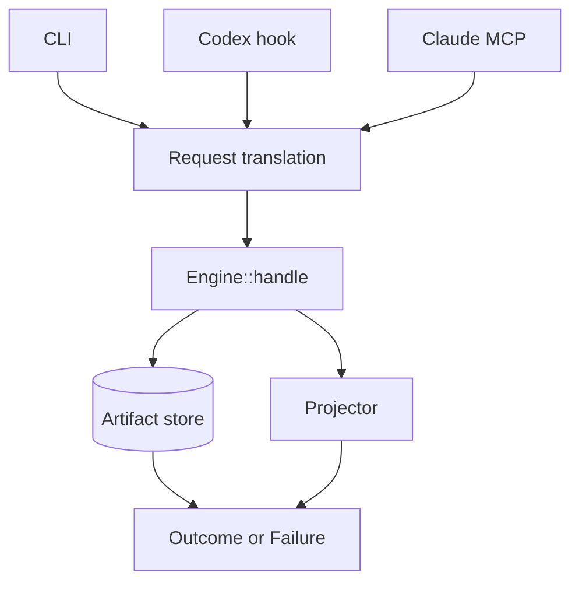

# Native context projection architecture

## Decision

Distill vNext is one Rust binary, `distill`, around one central engine boundary:

The versioned CLI and JSONL protocol are the product contract. Rust types remain
internal until a second in-process consumer creates a concrete library-stability
requirement.

This implements [ADR-001](ADR-001-context-projection-contract.md) and the Rust
selection in [ADR-002](ADR-002-language-and-persistence.md).

## Central engine

`native/distill-core/src/lib.rs` owns the capture transaction and coordinates:

- source acquisition from inline bytes, allowlisted files, argv-only
  subprocesses, and artifact references;
- persistence before any projection that omits source bytes;
- deterministic projection against an explicit byte or named-token budget;
- receipts, accounting, retention, recovery, tracing, and typed failures.

`native/distill-core/src/types.rs` defines the versioned request, outcome,
artifact, receipt, and failure shapes. No host-specific type crosses this
boundary.

## Persistence and recovery

`native/distill-core/src/artifact.rs` uses SQLite WAL for both source bytes and
metadata. The store:

- creates directories with mode `0700` and data with mode `0600` where POSIX
  enforcement is supported;
- commits source bytes before returning a reduced projection;
- verifies stored SHA-256 during recovery;
- distinguishes unknown, expired, corrupt, full, busy, and permission failures;
- retains expiration tombstones for the declared lifecycle;
- never evicts an unexpired artifact to satisfy the store cap.

Default retention is seven days and the default store cap is 512 MiB. V1 accepts
at most 10 MiB per observation and eight concurrent writers.

## Projection policy

`native/distill-core/src/projection.rs` provides deterministic extractive
profiles. It preserves mandatory spans, selects optional spans within the
remaining budget, and emits a receipt that maps visible and omitted spans to the
source digest.

Byte budgets are exact. Token budgets accept only the versioned
`cl100k_base@js-tiktoken-1.0.15` profile. An unknown tokenizer fails with
`token_profile_unsupported`; there is no silent fallback.

V1 does not include model-backed summarization, dynamic reducer plugins, AST
parsers, or executable user projection code.

## Acquisition

`native/distill-core/src/runtime.rs` owns bounded local acquisition:

- file reads require an explicit root and resist traversal and symlink
  replacement;
- process execution receives an executable and argv directly, without an
  implicit shell;
- time, source size, output, environment, and working directory are bounded;
- partial process observations preserve ordered events and typed termination
  metadata;
- captured bytes are never interpreted as commands, templates, or config.

## Adapters

`native/distill-core/src/cli.rs` exposes `project`, `artifact get`, `artifact
trace`, `status`, `gc`, `read`, and `run`.

`native/distill-core/src/codex.rs` translates supported Codex `PostToolUse`
events. It supports off, observe, and active modes and keeps blocking feedback
within the versioned model-visible limit. It cannot observe hosted or specialized
tools that emit no supported event.

`native/distill-core/src/mcp.rs` exposes only `distill_read` and `distill_run`.
They own acquisition and therefore can project before bytes enter Claude's
context. Native Claude `Read` and `Bash` remain outside Distill.

`native/distill-core/src/setup.rs` performs explicit, idempotent configuration
installation with dry-run, byte-exact backup, and restore.

Adapters may translate envelopes and enforce host limits. They may not own
projection, tokenization, persistence, or preservation policy.

## Distribution

V1 uses direct native release assets:

| Platform         | Rust host                  | Asset                         |
| ---------------- | -------------------------- | ----------------------------- |
| Linux x86_64 GNU | `x86_64-unknown-linux-gnu` | `distill-linux-x86_64.tar.gz` |
| macOS arm64      | `aarch64-apple-darwin`     | `distill-macos-arm64.tar.gz`  |

Each archive contains one executable, the MIT license, and installation
guidance. The executable uses the system runtime and SQLite libraries exercised
by its packaging host; the assets are not static or musl builds. An adjacent
SHA-256 file checks transfer integrity but does not authenticate the publisher.
Release publication must use an authenticated channel and a separately approved
signature or provenance policy. Assets are built on their supported packaging
host with `./scripts/package-native.sh`.

No npm launcher is selected for v1. One native executable is the product
boundary, and a launcher would add Node, platform resolution, and another
failure surface without a current requirement. This can be revisited if a
measured installation or update problem justifies it.

The asset contract is machine-readable in
[`docs/distribution/native-assets.json`](../distribution/native-assets.json).

## Observable release gates

The release gate must remain inspectable through committed evidence:

- Linux x86_64 contract, corpus, performance, recovery, and fuzz reports;
- macOS arm64 contract, corpus, setup, restore, and uninstall receipt;
- paired raw/projected task results and per-invocation Git attestations;
- an aggregate qualification that is `GO` only when paired and macOS gates are
  both `GO`.

The current aggregate is
[`evaluation/release/evidence/us018-qualification-v5.json`](../../evaluation/release/evidence/us018-qualification-v5.json).
It qualifies the current native tree on macOS arm64. The committed Linux report
targets an earlier native tree; Linux packaging is prepared but is not
publishable until the current tree passes the same release qualification.

## Deliberate boundaries

V1 makes no claim for Windows, macOS x86_64, Linux arm64, Linux musl, hosted
Codex tools without a supported event, Claude native tools, Cursor, Windsurf,
Continue, generic MCP clients, PTYs, remote execution, AST parity, QuickJS, or
automatic secret classification.

These are product boundaries, not silent fallbacks. A new surface requires a
versioned contract and release evidence before documentation can call it
supported.
