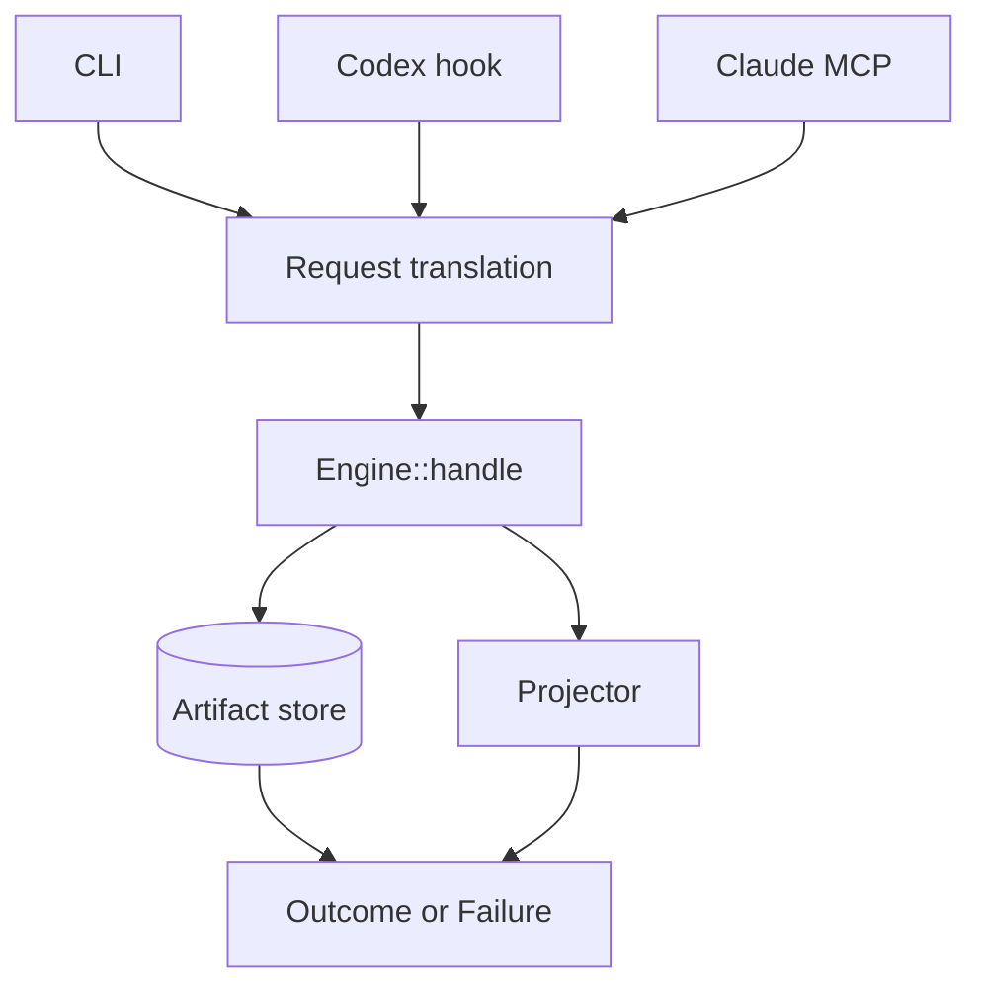

# Native context projection architecture

## Decision

Distill vNext is one Rust binary, `distill`, around one central engine boundary:

The versioned CLI and JSONL protocol are the product contract. Rust types remain
internal until a second in-process consumer creates a concrete library-stability
requirement.

This implements [ADR-001](ADR-001-context-projection-contract.md) and the Rust
selection in [ADR-002](ADR-002-language-and-persistence.md).

## Central engine

`src/lib.rs` owns the capture transaction and coordinates:

- source acquisition from inline bytes, allowlisted files, argv-only
  subprocesses, and artifact references;
- persistence before any projection that omits source bytes;
- deterministic projection against an explicit byte or named-token budget;
- receipts, accounting, retention, recovery, tracing, and typed failures.

`src/types.rs` defines the versioned request, outcome,
artifact, receipt, and failure shapes. No host-specific type crosses this
boundary.

## Persistence and recovery

`src/artifact.rs` uses SQLite WAL for both source bytes and
metadata. The store:

- creates directories with mode `0700` and data with mode `0600` where POSIX
  enforcement is supported;
- commits source bytes before returning a reduced projection;
- stores schema v3 SHA-256 digests over the exact acquisition and projection
  receipt blobs, then verifies each digest before decoding;
- validates acquisition completion, variant fields, and process event spans
  through one semantic implementation at construction, migration, recovery,
  replay, receipt insertion, and trace;
- migrates v2 proof blobs and their digests in one explicit transaction;
- caps exact receipt bytes at 64 MiB globally and 1 MiB per artifact in the
  same immediate transaction that assigns the per-artifact lineage sequence;
- commits receipt count, exact-byte usage, and a sequence-bound lineage hash
  head on the artifact row so missing tails and reordered rows fail closed;
- distinguishes unknown, expired, corrupt, full, busy, and permission failures;
- retains expiration tombstones for the declared lifecycle;
- never evicts an unexpired artifact to satisfy the store cap.

Trace preflights exact blob lengths, then verifies the artifact and complete
ordered lineage in one read snapshot because one artifact cannot exceed 1 MiB.
Status schema v2 reports current and maximum global lineage bytes.
Garbage-collection schema v2 reports reclaimed lineage bytes after cascading
receipt deletion.

Default retention is seven days and the source-byte store cap is 512 MiB. V1
accepts at most 10 MiB per observation and eight concurrent writers.

## Projection policy

`src/projection.rs` provides deterministic extractive
profiles. It preserves mandatory spans, selects optional spans within the
remaining budget, and emits a receipt that maps visible and omitted spans to the
source digest. Closed v1 profile identifiers and line rules are one internal
policy table. Over-budget text is scanned once for mandatory and optional
candidates, then planned with normalized spans and reusable byte accounting.
Token-budget proposals still receive exact full tokenization when selection
depends on it.

Byte budgets are exact. Token budgets accept only the versioned
`cl100k_base@js-tiktoken-1.0.15` profile. An unknown tokenizer fails with
`token_profile_unsupported`; there is no silent fallback.

V1 does not include model-backed summarization, dynamic reducer plugins, AST
parsers, or executable user projection code.

## Acquisition

`src/runtime.rs` owns bounded local acquisition:

- file reads require an explicit root and resist traversal and symlink
  replacement;
- process execution receives an executable and argv directly, without an
  implicit shell;
- one monotonic lifecycle owns spawn, nonblocking stdout and stderr drain,
  timeout, process-group termination, direct-child reap, and pipe teardown;
- every lifecycle wait is capped by one absolute deadline, including a 250 ms
  teardown tolerance after the declared process timeout;
- time, source size, output, environment, and working directory are bounded;
- partial process observations preserve ordered events and typed termination
  metadata;
- captured bytes are never interpreted as commands, templates, or config.

## Adapters

`src/cli.rs` exposes `project`, `artifact get`, `artifact
trace`, `status`, `gc`, `read`, and `run`.

`src/codex.rs` translates supported Codex `PostToolUse`
events. It supports off, observe, and active modes and keeps blocking feedback
within the versioned model-visible limit. It cannot observe hosted or specialized
tools that emit no supported event.

`src/mcp.rs` exposes only `distill_read` and `distill_run`.
They own acquisition and therefore can project before bytes enter Claude's
context. Native Claude `Read` and `Bash` remain outside Distill.

`src/setup.rs` performs explicit, idempotent configuration
installation with dry-run, byte-exact backup, and restore. Codex setup accepts
only Codex modes and rejects roots; Claude setup accepts only unique roots and
rejects Codex modes. Target validation completes before configuration mutation.

Adapters may translate envelopes and enforce host limits. They may not own
projection, tokenization, persistence, or preservation policy.

## Distribution

Native v0.1.0 uses one public scoped npm package containing both qualified
executables:

| Platform         | Rust host                  | Asset                         |
| ---------------- | -------------------------- | ----------------------------- |
| Linux x86_64 GNU | `x86_64-unknown-linux-gnu` | `distill-linux-x86_64.tar.gz` |
| macOS arm64      | `aarch64-apple-darwin`     | `distill-macos-arm64.tar.gz`  |

Each intermediate archive contains one executable, the MIT license, and
installation guidance. `scripts/package-npm.sh` verifies their adjacent
checksums, exact platform identity, platform receipts, every required gate, the
aggregate `GO` receipt, and embedded binary digests before producing
`@arthjean/distill`.

The npm package performs no installation-time download or compilation. npm
rejects operating systems other than Linux and macOS. Its POSIX launcher is not
a Node runtime boundary: it selects Linux x86_64 only when GNU libc is detected,
selects macOS arm64, and rejects unsupported architectures and Linux runtimes
before invoking a binary. The native executable continues to use the system
runtime and SQLite libraries exercised by its packaging host; it is not static
or musl.

Authenticated npm publication supplies package SHA-512 integrity and registry
ECDSA signatures. The release does not claim a GitHub provenance attestation.
Native archives are built on their supported packaging host with
`./scripts/package-native.sh`.

The asset contract is machine-readable in
[`docs/distribution/native-assets.json`](../distribution/native-assets.json).

## Observable release gates

The release gate must remain inspectable through committed evidence:

- Linux x86_64 contract, corpus, performance, recovery, and fuzz reports;
- macOS arm64 contract, corpus, setup, restore, and uninstall receipt;
- paired raw/projected task results and per-invocation Git attestations;
- an aggregate qualification that is `GO` only when paired and macOS gates are
  both `GO`.

The historical aggregate remains
[`evaluation/release/evidence/us018-qualification-v5.json`](../../evaluation/release/evidence/us018-qualification-v5.json).
The root Cargo crate is qualified separately by
`architecture-hardening-v5-20260731`, whose external aggregate is `GO` for
source tree `4fd63a6a4ef6e87f3e05134183477e5831dc67f5`. Its Linux and macOS release
binary digests match the candidate executables. The package metadata and
launcher are qualified separately under
`architecture-hardening-v6-20260731`; its aggregate is `GO` for source tree
`952711e440754621080d45f8870c55c3b3ce17c3` and permits npm publication.

## Deliberate boundaries

V1 makes no claim for Windows, macOS x86_64, Linux arm64, Linux musl, hosted
Codex tools without a supported event, Claude native tools, Cursor, Windsurf,
Continue, generic MCP clients, PTYs, remote execution, AST parity, QuickJS, or
automatic secret classification.

These are product boundaries, not silent fallbacks. A new surface requires a
versioned contract and release evidence before documentation can call it
supported.
