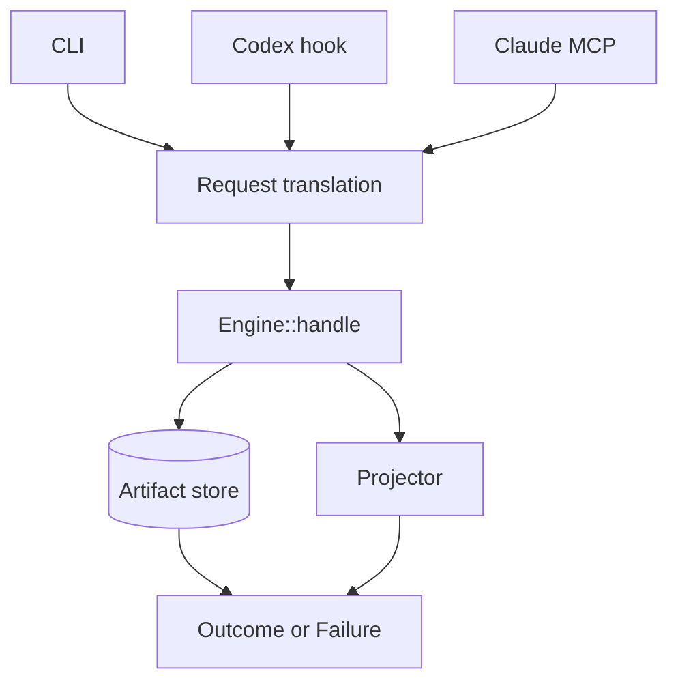

# Native context projection architecture

## Decision

Distill vNext is one Rust binary, `distill`, around one central engine boundary:

The versioned CLI and JSONL protocol are the product contract. Rust types remain
internal until a second in-process consumer creates a concrete library-stability
requirement.

This implements [ADR-001](ADR-001-context-projection-contract.md) and the Rust
selection in [ADR-002](ADR-002-language-and-persistence.md).

## Central engine

`src/lib.rs` owns the capture transaction and coordinates:

- source acquisition from inline bytes, allowlisted files, argv-only
  subprocesses, and artifact references;
- persistence before any projection that omits source bytes;
- deterministic projection against an explicit byte or named-token budget;
- receipts, accounting, retention, recovery, tracing, and typed failures.

`src/types.rs` defines the versioned request, outcome,
artifact, receipt, and failure shapes. No host-specific type crosses this
boundary. `src/types/acquisition.rs` converts that wire DTO into an exhaustive
internal acquisition state, so runtime and persistence code cannot construct
contradictory completion, partial, truncation, or process-terminal states.

## Persistence and recovery

`src/artifact.rs` and its `src/artifact/` modules use SQLite WAL for both source
bytes and metadata. Connection and schema management, receipt lineage, store
lifecycle, migration, and permissions have separate ownership. The store:

- creates directories with mode `0700` and data with mode `0600` where POSIX
  enforcement is supported;
- commits source bytes before returning a reduced projection;
- stores schema v3 SHA-256 digests over the exact acquisition and projection
  receipt blobs, then verifies each digest before decoding;
- validates acquisition completion, variant fields, and process event spans
  through one semantic implementation at construction, migration, recovery,
  replay, receipt insertion, and trace;
- migrates either v1 or v2 stores to v3 in one explicit transaction, including
  creation and hashing of receipt lineage state;
- creates or migrates the database only during engine initialization;
  steady-state operations open an existing schema v3 store and never silently
  recreate or migrate it;
- caps exact receipt bytes at 64 MiB globally and 1 MiB per artifact in the
  same immediate transaction that assigns the per-artifact lineage sequence;
- commits receipt count, exact-byte usage, and a sequence-bound lineage hash
  head on the artifact row so missing tails and reordered rows fail closed;
- distinguishes unknown, expired, corrupt, full, busy, and permission failures;
- retains expiration tombstones for the declared lifecycle;
- never evicts an unexpired artifact to satisfy the store cap.

Trace preflights exact blob lengths, then verifies the artifact and complete
ordered lineage in one read snapshot because one artifact cannot exceed 1 MiB.
Status schema v2 reports current and maximum global lineage bytes.
Garbage-collection schema v2 reports reclaimed lineage bytes after cascading
receipt deletion.

Default retention is seven days and the source-byte store cap is 512 MiB. V1
accepts at most 10 MiB per observation and eight concurrent writers.

## Projection policy

`src/projection.rs` provides deterministic extractive
profiles. It preserves mandatory spans, selects preferred spans within the
remaining budget, and emits a receipt that maps visible and omitted spans to the
source digest. Over-budget text is scanned once for mandatory and preferred
candidates, then planned as a set of spans carrying their own counts.

The policy is derived from the observation rather than declared by the caller.
`src/projection/shape.rs` classifies a bounded prefix into one of the eight
shapes of ADR-001 and returns the line policy of that shape; `ProjectionSpec`
resolves `auto/v1` once, before analysis, and records the applied policy in the
receipt. Adapters keep passing a profile identifier and no host type enters the
policy, so `Engine::handle` remains the only policy seam. Because a shape maps
to a fixed line policy, the table stays `&'static` and dispatch is a match, not
a dynamic registry.

Classification reads at most 64 KiB and 512 lines: tool output announces its
family in its first screens, so a 10 MiB observation costs the same decision as
a small one. Every rule is structural, so a policy cannot pass a gate by
recognizing its own test data.

`src/projection/aggregate.rs` groups the redundant lines of the shapes whose
repetition is mechanical. Value-shaped tokens are masked, lines are bucketed by
token count and leading token, and a line joins a template when at least half of
its positions agree: Drain as a design reference, implemented in-crate with a
bucket cap, a global template cap, and a line cap, so grouping cost stays bounded
instead of growing with input size. Runs of at least three consecutive ordinary
lines that repeat a known template become collapsed runs; everything else stays
verbatim.

`src/projection/focus.rs` orders candidates when the request states what it is
reading for. The focus is split into at most 16 literal terms on non-word
characters, and the ranking pass records, per line, which terms it carries as one
bitmask. Which terms actually locate an answer is only knowable once the whole
observation has been ranked, so scoring resolves after that pass: a term the
observation carries in more than a quarter of its lines describes the whole of it
and ranks nothing, which is what stops a focus written as a sentence from
ordering by its articles. Candidates then sort by lexical proximity, then by the
structural rank of the shape policy, then by source position.

A focus promotes lines the shape policy ranked ordinary, because what answers a
question is rarely what orders the output. The reducer work limit therefore
applies once per reason a line can rank: at most 256 structural candidates and at
most 256 focused ones, so a focus reaches the whole observation rather than the
prefix whose structure already filled the table, and a preferred line is never
crowded out. A promoted line that no discriminating term reached is dropped
again, so an uninformative focus leaves the candidate set exactly where it was.
Scoring is substring comparison and never tokenizes, so the tokenization bound
below is unchanged.

Planning is incremental. A plan's count is the sum of its span counts, which is
exact because every span boundary is anchored to an additive offset: the start
of the text, its end, or a line break followed by a line that reaches a
non-whitespace character before any further line break. `cl100k` joins a line
break with the whitespace run that the next break closes, so those are the only
offsets where token counts add. Accepting a candidate therefore counts only the
source the plan did not already cover, and a projection tokenizes its rendered
payload exactly once, to verify the count planning carried. A disagreement
returns `invariant_breach` instead of a payload.

Selection then spends whatever payload budget it left. Retained spans grow
outward one line group at a time, alternating between frontiers so the visible
payload keeps both the head and the tail of the observation, until no further
line group fits. A frontier that fails is retired, because the remaining budget
never grows back. Selection that finds no candidate at all still falls back to
the longest fitting prefix, cut on a UTF-8 boundary.

Expansion runs in two passes. The first steps over every collapsed run and keeps
its annotation, so the budget buys distinct content instead of redundancy. The
second runs only when the first ran out of source rather than out of budget, and
grows contiguously through the collapsed runs: unspent budget helps nobody, but
budget spent on redundancy is what aggregation exists to prevent. A plan carries
the count of its annotations alongside the count of its spans, so the payload
budget covers the text the projection synthesizes as well as the source it
retains, and the single verification tokenization still has to agree.

The planner enforces the persisted receipt span limit before it returns a
projection, including both retained and omitted partitions. At the ceiling a
candidate is bridged to its nearest retained neighbour, so a fragment is merged
rather than dropped and the partition stays exact.

## Bounded artifact retrieval

`src/projection/retrieval.rs` resolves a `distill.context/v3` artifact selector
into line-aligned source regions. A line selector yields one contiguous region.
A pattern selector scans the artifact once with `str::match_indices`, whose
two-way substring search is linear in the source length, expands each occurrence
to whole lines plus its bounded context, and merges regions that overlap or
touch. Matching is literal: no regular-expression engine exists in the binary,
so an agent-supplied pattern cannot describe catastrophic backtracking.

Retrieval reuses `Engine::handle` rather than adding a second policy path. The
selected regions are concatenated and projected by the same planner, then the
retained spans are translated back into original source offsets. Because
translation can split one planned span at each region boundary, the planner
receives a span ceiling reduced by the region count, which keeps both persisted
partitions inside the receipt limit. The omitted complement is recomputed over
the whole source, so a selected projection still partitions the artifact
exactly, and `original_count` still counts the complete artifact.

Work is bounded by the selector rather than by the source: at most 32 matches
and at most 16 context lines on each side, so a selection holds at most 32
regions and the retrieval allocation is one copy of the selected region bytes
plus a 32-entry region table. The 10 MiB observation ceiling therefore bounds
peak retrieval allocation at one additional source copy, and a single linear
scan over a 10 MiB artifact stays far inside the 500 ms P95 retrieval envelope.

Selection applies to valid UTF-8 artifacts. A selector over a non-UTF-8 artifact
fails with `invalid_request`, and the envelope of a binary projection therefore
states its omission without naming a retrieval operation it cannot serve.

Byte budgets are exact. Token budgets accept only the versioned
`cl100k_base@js-tiktoken-1.0.15` profile. An unknown tokenizer fails with
`token_profile_unsupported`; there is no silent fallback.

V1 does not include model-backed summarization, dynamic reducer plugins, AST
parsers, or executable user projection code.

## Acquisition

`src/runtime.rs` owns bounded local acquisition. Process-pipe polling and child
lifecycle mechanics are isolated in `src/runtime/process.rs`:

- file reads require an explicit root and resist traversal and symlink
  replacement;
- process execution receives an executable and argv directly, without an
  implicit shell;
- one monotonic lifecycle owns spawn, nonblocking stdout and stderr drain,
  timeout, process-group termination, direct-child reap, and pipe teardown;
- every lifecycle wait is capped by one absolute deadline, including a 250 ms
  teardown tolerance after the declared process timeout;
- time, source size, output, environment, and working directory are bounded;
- partial process observations preserve ordered events and typed termination
  metadata;
- captured bytes are never interpreted as commands, templates, or config.

## Adapters

`src/cli.rs` exposes `project`, `artifact get`, `artifact
trace`, `artifact slice`, `artifact search`, `status`, `gc`, `read`, and `run`.

`src/codex.rs` translates supported Codex `PostToolUse`
events. It supports off, observe, and active modes and keeps blocking feedback
within the versioned model-visible limit. Supported tool names and the `mcp__`
family are classified positively; any received unknown surface fails closed
with `unsupported_surface`. It cannot observe hosted or specialized tools that
emit no supported event.

`src/mcp.rs` exposes only `distill_read`, `distill_run`,
`distill_artifact_slice`, and `distill_artifact_search`. The first two own
acquisition and therefore can project before bytes enter Claude's context.
Native Claude `Read` and `Bash` remain outside Distill. The retrieval pair
resolves an artifact identifier and reuses `Engine::handle` with a selector, so
recovering an omitted region never leaves the agent's own surface and never
publishes the unbounded `artifact get` path.

`src/setup.rs` performs explicit, idempotent configuration
installation with dry-run, byte-exact backup, and restore. Codex setup accepts
only Codex modes and rejects roots; Claude setup accepts only unique roots and
rejects Codex modes. A Codex hook is owned only when its matcher, single command
hook, timeout, status, and Distill command suffix all match; ambiguous status
collisions fail without mutation. Target validation completes before
configuration mutation.

Adapters may translate envelopes and enforce host limits. They may not own
projection, tokenization, persistence, or preservation policy.

## Distribution

Native v0.1.0 uses one public scoped npm package containing both qualified
executables:

| Platform         | Rust host                  | Asset                         |
| ---------------- | -------------------------- | ----------------------------- |
| Linux x86_64 GNU | `x86_64-unknown-linux-gnu` | `distill-linux-x86_64.tar.gz` |
| macOS arm64      | `aarch64-apple-darwin`     | `distill-macos-arm64.tar.gz`  |

Each intermediate archive contains one executable, the MIT license, and
installation guidance. `scripts/package-npm.sh` verifies their adjacent
checksums, exact platform identity, platform receipts, every required gate, the
aggregate `GO` receipt, and embedded binary digests before producing
`@arthjean/distill`.

The npm package performs no installation-time download or compilation. npm
rejects operating systems other than Linux and macOS. Its POSIX launcher is not
a Node runtime boundary: it selects Linux x86_64 only when GNU libc is detected,
selects macOS arm64, and rejects unsupported architectures and Linux runtimes
before invoking a binary. The native executable continues to use the system
runtime and SQLite libraries exercised by its packaging host; it is not static
or musl.

Authenticated npm publication supplies package SHA-512 integrity and registry
ECDSA signatures. The release does not claim a GitHub provenance attestation.
Native archives are built on their supported packaging host with
`./scripts/package-native.sh`.

The asset contract is machine-readable in
[`docs/distribution/native-assets.json`](../distribution/native-assets.json).

## Observable release gates

The release gate must remain inspectable through committed evidence:

- Linux x86_64 contract, corpus, performance, recovery, and fuzz reports;
- macOS arm64 contract, corpus, setup, restore, and uninstall receipt;
- paired raw/projected task results and per-invocation Git attestations;
- an aggregate qualification that is `GO` only when paired and macOS gates are
  both `GO`.

The historical aggregate remains
[`evaluation/release/evidence/us018-qualification-v5.json`](../../evaluation/release/evidence/us018-qualification-v5.json).
The root Cargo crate is qualified separately by
`architecture-hardening-v5-20260731`, whose external aggregate is `GO` for
source tree `4fd63a6a4ef6e87f3e05134183477e5831dc67f5`. Its Linux and macOS release
binary digests match the candidate executables. The package metadata and
launcher are qualified separately under
`architecture-hardening-v6-20260731`; its aggregate is `GO` for source tree
`952711e440754621080d45f8870c55c3b3ce17c3` and permits npm publication.

## Deliberate boundaries

V1 makes no claim for Windows, macOS x86_64, Linux arm64, Linux musl, hosted
Codex tools without a supported event, Claude native tools, Cursor, Windsurf,
Continue, generic MCP clients, PTYs, remote execution, AST parity, QuickJS, or
automatic secret classification.

These are product boundaries, not silent fallbacks. A new surface requires a
versioned contract and release evidence before documentation can call it
supported.
