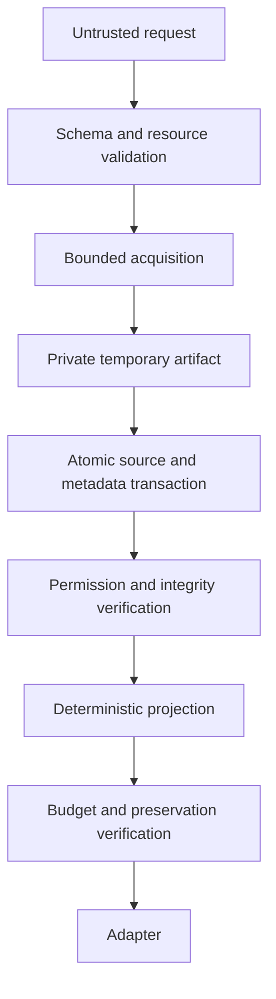

# Context projection data threat model

- Version: 1.0
- Date: 2026-07-24
- Status: Accepted for the language-spike gate
- Contract: [ADR-001](../architecture/ADR-001-context-projection-contract.md)

## Security objective

Distill captures attacker-controlled local observations, persists the original
bytes, and returns a smaller model-visible projection. The security objective is
to preserve confidentiality and artifact integrity without turning stored
content into an executable input or silently losing recoverability.

The primary fail-closed invariant is:

```text
No unsafe root, failed permission check, failed atomic commit, or failed
integrity check may produce a projection that omits source bytes.
```

Distill is local software, not a sandbox for an already compromised user
account. A process with the user's credentials can usually read that user's
files, database, and configuration. Controls still reduce accidental exposure,
cross-user access, confused-deputy behavior, and corruption.

## Assets and security properties

| Asset | Required property |
|---|---|
| Raw output | Byte integrity, bounded lifetime, user-only access, no implicit interpretation |
| Artifact metadata | Integrity, bounded fields, no raw body leakage, stable lineage |
| Projection receipts | Correct source binding, no forged preservation or budget claim |
| Configuration | User-only write access, bounded parsing, safe defaults |
| Host events | Schema validation, size limits, explicit support matrix |
| Local process requests | Argv execution only, bounded environment, timeout and output limits |
| Filesystem roots | Canonical configured ownership, no traversal or symlink escape |
| Adapter configuration | Explicit mode, supported schema version, no unsafe raw fallback |

Availability is bounded rather than absolute. Distill must resist indefinite
waits, unbounded memory, unbounded disk use, and writer starvation while
returning typed failures when configured limits are exhausted.

## Trust zones

1. **Untrusted observation zone:** raw inline bytes, file contents, process
   output, filenames, argv, host events, and artifact lookup input. Prompt-like
   text has no authority here.
2. **Validated request zone:** decoded, versioned, size-bounded contract values.
   Validation establishes shape only; content remains untrusted.
3. **Acquisition zone:** local filesystem and child-process access through the
   runtime boundary. Paths and process options are security-sensitive.
4. **Artifact zone:** the private store root, database, source objects, and
   tombstones. Only committed and verified artifacts are addressable.
5. **Projection zone:** deterministic policies reading committed source bytes.
   Reducers cannot execute, import, interpolate, or reconfigure from content.
6. **Adapter and host zone:** model-visible injection and host-specific event
   translation. The adapter is responsible for envelope accounting and raw
   exposure policy.
7. **Other local processes:** same-user and cross-user processes that may race
   files, consume resources, lock the store, or mutate adapter inputs.

No runtime data path requires an outbound network boundary. Capture,
projection, retrieval, tracing, and garbage collection make zero outbound
network requests.

## Data flow and commit boundary



Temporary files are created inside the validated private store. They are never
made model-visible and never treated as committed artifacts. A valid reference
is minted only after the database transaction and source object are durable.
Interrupted work leaves either the prior state or the complete new state.

## Data lifecycle

The default artifact lifetime is seven days. The resolved absolute `expires_at`
is stored in every artifact reference. The default total source-byte cap is
512 MiB.

Before accepting new capture, the store may remove expired source objects and
their reclaimable metadata. It never evicts an unexpired artifact early. If the
new source still cannot fit and no expired source can be reclaimed, capture
returns `store_full`; no omitting projection is released.

Garbage collection replaces each deleted source record with a metadata-only
expiration tombstone. A tombstone contains the opaque artifact ID, deletion
time, former expiration time, schema version, and failure classification. It
does not retain source bytes, source excerpts, paths, argv, environment data, or
secret-bearing metadata. Tombstones expire 30 days after source deletion:

- before source expiration: retrieval succeeds after digest verification;
- after source deletion and before tombstone expiry: `artifact_expired`;
- after tombstone expiry, or for an ID never present: `artifact_unknown`;
- for bytes or metadata that fail integrity validation: `artifact_corrupt`.

Retention deletion is not secure erasure. Filesystems, snapshots, backups, WAL
pages, swap, and storage devices can retain recoverable remnants. V1 does not
claim forensic deletion.

## Filesystem and permissions policy

The store root is selected from an explicit local configuration or a
platform-specific user data location. It must be absolute after resolution,
owned by the current user, not a symlink, not group- or world-writable, and not
inside a configured project source root. An unsafe root returns `unsafe_root`.

On POSIX systems:

- directories are created with mode `0700`;
- source objects, database files, WAL files, shared-memory files, lock files,
  receipts, and configuration are created with mode `0600`;
- the process applies a restrictive creation mask while creating store objects;
- every opened store object is verified through the open file descriptor;
- a mode or ownership mismatch is corrected only when the object is already
  owned by the current user, then rechecked;
- inability to enforce or verify ownership and permissions fails closed.

macOS uses the same POSIX verification through descriptor metadata. The
conformance probe must run on macOS arm64 and verify the effective mode after
creation, after reopen, and while a permissive caller creation mask is active.
ACLs or filesystem semantics that still grant another identity access cause the
probe and engine startup to fail. A platform without equivalent enforceable
user-only permissions is unsupported rather than silently degraded.

Project file acquisition uses configured root identities. The engine opens from
the root directory handle, rejects absolute paths, `..`, empty components,
embedded NUL, and platform prefix tricks, and refuses symlink traversal. It
compares the identity and type of the opened object with the validated
descriptor before and after reading. A swap or escape returns `unsafe_root` or
`acquisition_failed`, not partial content.

## Process policy

Process capture accepts an executable and an argv vector. It never passes an
untrusted string to a shell, never prepends shell switches, and never reparses
argv. Leading hyphens inside an argument remain data for the selected
executable; adapters that construct utility arguments must insert a documented
option terminator where that utility supports one.

The working directory is resolved beneath a configured root. Environment
inheritance is disabled by default; a named profile allowlists variables and
caps key and value lengths. Secret values in configured environment metadata are
redacted from receipts and logs.

Execution has a wall timeout, output-byte cap, bounded event count, bounded
stderr/stdout buffering, and a termination escalation. Exit code, signal,
timeout, chronological stream events, working directory identity, and
truncation state are recorded separately. A timeout, external kill, spawn
failure, or output limit returns a typed acquisition failure. Partial bytes may
be committed for diagnosis but are never presented as a complete projection.

## Threat and control matrix

| Threat | Attack or failure | Required control and failure |
|---|---|---|
| Secret or PII exposure | Source, path, argv, receipt, log, or trace leaks sensitive data | Private store permissions; bounded allowlisted metadata; no raw bodies in logs; redact configured secret values; active mode exposes only the verified projection |
| Prompt injection | Stored bytes claim to be instructions or configuration | Content is inert data; reducers use fixed policies; no prompt execution, model call, template evaluation, or policy mutation from source |
| Path traversal | Relative path escapes an allowed root | Descriptor-relative open, reject absolute and parent components, verify opened identity; fail `unsafe_root` |
| Symlink race | Attacker swaps a checked path before read or write | No check-then-open authorization; no-follow descriptor operations; pre/post identity checks; abort acquisition |
| Option injection | Filename or content becomes a utility flag | Direct system APIs where possible; fixed argv; option terminator for utilities; no concatenated command |
| Command injection | Source, executable, or argv reaches a shell | No implicit shell, interpolation, command templates, or stored-command replay |
| Malformed Unicode | Decoder replaces or drops source bytes | Persist original bytes first; validate or deterministically encode model-visible text; byte offsets refer to original bytes |
| Binary input | NULs or arbitrary bytes corrupt a text reducer | Explicit binary policy and deterministic encoded or metadata-only fidelity; no C-string assumptions |
| Disk exhaustion | Capture fills disk or exceeds quota | 512 MiB logical cap, preflight reservation, bounded temp files, expired-only GC, atomic failure as `store_full` or `commit_failed` |
| Database corruption | Metadata or WAL is damaged or inconsistent with objects | Integrity checks, schema versioning, digest verification, backup/recovery procedure; return `artifact_corrupt`; never return unverified bytes |
| Concurrent writers | Races lose commits, reuse IDs, or wait forever | Transactions, unique opaque IDs, bounded busy timeout, at most eight writers, crash tests; return `store_busy` |
| Stale hook or event schema | Adapter misreads a changed host payload | Exact versioned decoding, allowlisted event kinds, reject unknown required fields, observe-before-active rollout |
| Unsafe configuration | Attacker changes roots, mode, or retention | User-only configuration, strict schema, no source-derived config, startup validation; fail closed |
| Resource amplification | Huge lengths, event counts, nesting, or encoded payloads exhaust memory or CPU | 10 MiB source cap, checked arithmetic, bounded parsers, streaming capture, timeouts, no implicit decompression |
| Artifact enumeration | Predictable IDs reveal source existence | Random opaque IDs, constant-shape unknown/expired responses where practical, no content-derived public ID |
| Rollback or stale receipt | Old policy or receipt is presented as current | Version all schemas and policies; bind receipt to source digest and artifact; reject incompatible versions |

If compression or another encoded format is introduced later, its decoder must
enforce compressed and expanded byte limits before use. V1 has no decompression
feature and therefore no decompression-bomb compatibility path.

## Failure semantics

These failures are distinct because operators act on them differently:

- `store_full`: the valid store has no capacity without violating retention;
- `artifact_expired`: a tombstone proves the artifact existed but its source
  lifetime ended;
- `artifact_corrupt`: an expected artifact or metadata record fails integrity.

A failed permission check, unsafe root, database integrity failure, failed
atomic commit, or uncertain transaction outcome returns a failure and no
omitting projection. Previously committed artifacts remain retrievable whenever
their own integrity checks pass.

Error messages expose failure class, safe operation identifiers, and bounded
diagnostics. They never embed raw source bodies. Paths are represented by
configured root ID plus a redacted or escaped relative form; control characters
cannot forge log lines.

## Stored-content non-interpretation

Source bytes are read only by artifact retrieval and deterministic projection
policies. They are never:

- executed as a command or argv;
- parsed as engine or adapter configuration;
- interpolated into a command, template, path, query, or log format;
- imported as code or dynamically loaded;
- submitted to a generative model by the central engine; or
- treated as instructions because they resemble a system or user prompt.

Artifact retrieval returns verified bytes as data. A caller choosing to execute
retrieved bytes is outside the engine contract and must make that authority
explicit.

## Verification requirements

The language spikes and selected engine must supply automated evidence for:

1. effective `0700` and `0600` modes, ownership, permissive caller masks, and
   fail-closed behavior on Linux x86_64 and macOS arm64;
2. traversal, symlink swap, embedded NUL, absolute path, and root replacement;
3. argv preservation, option-shaped values, command-injection strings, timeout,
   output cap, signal, and child cleanup;
4. invalid UTF-8, binary bytes, prompt-injection-shaped content, maximum lengths,
   integer overflow, and corrupted store pages;
5. disk full, lock timeout, killed writer at each commit boundary, and eight
   concurrent writers;
6. zero outbound connections during capture, projection, retrieval, trace, and
   garbage collection; and
7. zero source-body leakage in logs, receipts, errors, and tombstones.

Release evidence records the platform, filesystem, effective user, toolchain,
and exact test command. Unsupported permission enforcement is a failed gate.

## Explicit non-guarantees

V1 does not guarantee automatic secret or PII detection. A projection policy
can preserve, omit, or expose sensitive text according to its fact rules, so
users must treat the local store and model-visible output as sensitive.

V1 does not provide application-level at-rest encryption. It relies on
user-only filesystem permissions and any full-disk encryption configured by the
operator. Encryption, key management, secure erasure, network synchronization,
cloud recovery, and protection from a compromised user account require separate
decisions.
